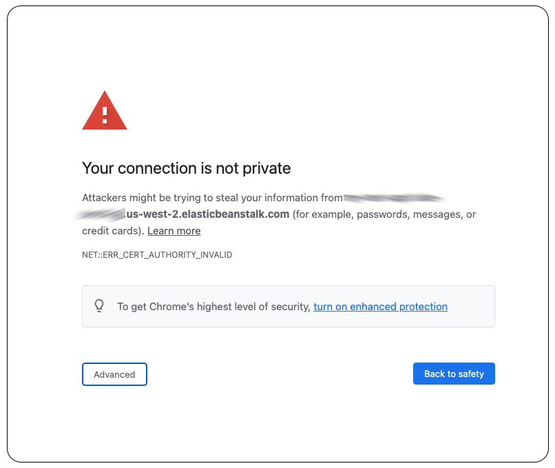
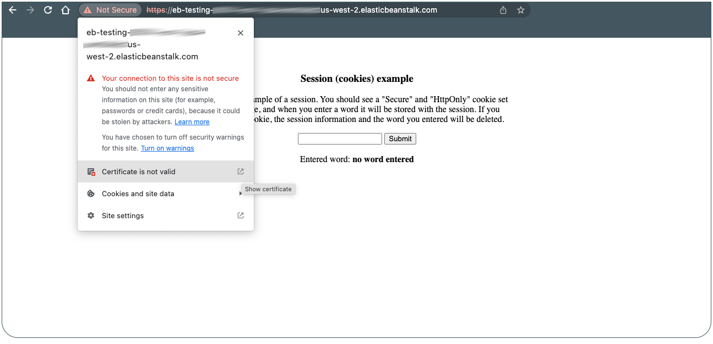
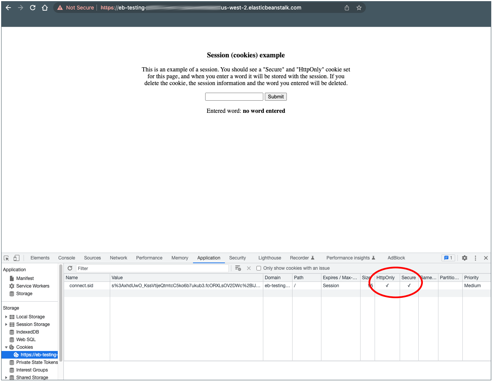

# Launch a secure Node.js dev environment

This repo (and guide) illustrate the process of launching a secure Node.js application environment, while also minimizing cost. As production features (e.g., Load Balancer, backups, managed updates) are not used, this environment is intended to be used for development purposes. To minimize cost, a single instance (no Load Balancer) Beanstalk environment will be used running on a spot instance. 

## Cost

The environment **should** not cost more then $6/month, and will probably be around $3.50/month. Please ensure that you are using an instance that will meet your cost requirements.

## Documentation

Below, I provide the steps needed to launch the environment using a setup command (`setupBeanstalk.py`). Additionally, I have documented the entire process in detail: [Deploy a secure Node.js app in a dev environment](https://veloduff.github.io/deploy-secure-nodejs-env/). If you are familiar with AWS Elastic Beanstalk, you may be able to skip steps in the documentation, but you should at least read the documentation to understand what is being done.

## Steps

Here is an overview of the steps:

1. Initialize the node app, and install dependencies:
   ```bash
   $ npm init es6 -y
   $ npm i express express-session dotenv body-parser
   ```
1. Create the application 
1. Verify the application can run locally
1. Run the setup script 
1. Deploy:
   1. Run `eb init`
   1. Run `eb create`

### Node.js application

It is required that you have a Node.js application, and the application is using https at the application level. I have provided an example: `session-with-https.js`. 

**NOTE**: As the certificate files have not been created yet, you will not be able to run the application until you have run the setup command also (steps below), or you have gone through the steps in the [Documentation](https://veloduff.github.io/deploy-secure-nodejs-env/).

Application setup (example based on provided application):
```bash
[~/repos]$ mkdir app-testing && cd app-testing 
[~/repos/app-testing]$ npm init es6 -y
[~/repos/app-testing]$ npm i express express-session dotenv body-parser
```

Now create (cut-n-paste) the application `app.js` using the `session-with-https.js` as the source. The final Node.js project structure should look like this:

```bash
.
├── app.js
├── node_modules/
├── package-lock.json
└── package.json
```

### Run the setup command 

To use the setup command `setupBeanstalk.py`, you can clone the repo, but do not clone it in the same directory as the Node.js app. 

There are no dependencies for running the setup command, but you should be familiar with the files and directories that are created (shown in the output below and the [Documentation](https://veloduff.github.io/deploy-secure-nodejs-env/)). The setup command is **run at the root of the Node.js project directory**, and has one required argument: the location of the SSL certificates directory (which you provide).

There a few prompts for the commands:

1. For the `-d` parameter, you will be asked if you are sure that this is the location you want to use to create your SSL key/certificate files. As this directory **should not be publicly accessible** (i.e., not on GitHUb), it is worth double checking it is in a secure location.
1. You will also be prompted for the location of both the `.gitignore` and `.ebignore` files. (can optionally select "NONE")

The output below shows which files and directories are being created. Each of these is described in detail in the [Documentation](https://veloduff.github.io/deploy-secure-nodejs-env/).

Here are the steps to clone and run the setup command. You will need to verify that the application can run locally before deploying.

```bash
[~/repos/app-testing]$ cd .. 
[~/repos]$ git clone https://github.com/veloduff/deploy-secure-nodejs-env
[~/repos]$ cd app-testing 
[~/repos/app-testing]$ ~/repos/deploy-secure-nodejs-env/setupBeanstalk.py -d ../Secure_Location/.certificates

  The ../Secure_Location/.certificates/ directory should be located outside of the project
    directory or should be in both the .gitignore file and .ebignore files.

  Should the ../Secure_Location/.certificates/ directory still be used for the certificates?[YES/no]:

  Creating Beanstalk SSL file           .ebextensions/ssl-file.config
  Creating web server key               ../Secure_Location/.certificates/myWebServerKey.pem
  Creating web server certificate       ../Secure_Location/.certificates/myWebServerCert.pem
  Creating application key              ../Secure_Location/.certificates/myAppKey.pem
  Creating application certificate      ../Secure_Location/.certificates/myAppCert.pem
  Creating pass phrase file             ../Secure_Location/.certificates/pass_phrase.txt
  Creating Beanstalk options file       .ebextensions/options.config
  Creating Beanstalk sec group file     .ebextensions/sec-group.config
  Creating Nginx https config file      .platform/nginx/conf.d/https.conf
  Creating Nginx server config file     .platform/nginx/nginx.conf
  Creating .env file                    .env

Both .gitignore and .ebignore files should be created as well. Please give the locations of each, or "NONE" to skip:
  Location of .gitignore, it will be copied to cwd: [~/repos/gitignore/.gitignore]:
  Location of .ebignore, it will be copied to cwd: [~/repos/gitignore/.ebignore]:

Setup finished, now verify the application works.
>>>> 1. VERIFY <<<<
  First test the app by running 'node app.js', and go to https://localhost:3030 (note https)

>>>> 2. DEPLOY <<<<
  Once you have verified the application is working, you can deploy to Beanstalk.
  Run 'eb init' and 'eb create' commands, for example (mykeyName is your AWS API key name):

    $ eb init
    $ eb create --single --enable-spot --instance-types t3.nano,t3.micro <env_name_is_here>

```

### Verify application can run locally

As noted in the command output, you will need to verify that the application can run locally before deploying. You can do this with the `node` command:

```bash
$ node app.js
https server started on port 3030 running in development
```

Now go to https://localhost:3030 (note https) to verify.

### Deploy

Once you have verified that the application can run locally, you can deploy to Beanstalk. The `eb init` command has several prompts, which can optionally be given as arguments to the command.

```bash
$ eb init
$ eb create --single --enable-spot --instance-types t3.nano,t3.micro <env_name_is_here>
```

Once the deployment is completes, you should see a line in the output that looks like this:

`Application available at sessions-test-app1-env1.eba-xxxxxxxx.us-west-2.elasticbeanstalk.com.`

Open the link in your browser, it should not matter if you use `http://` or `https://` for the url, you should be redirected to the https page. 

As we are using a self-signed certificate, you will see a warning that looks like this:




Click on "Advanced" and then click on the message that says something similar to this: "Proceed to sessions-test-app1-env1.eba-xxxxxxxx.us-west-2.elasticbeanstalk.com (unsafe)".

You should see your app running on https, and you can check the certificate by clicking on the "Not Secure" button next to the URL.



### Check that the session is Secure and using HttpOnly

Use Chrome to load the page, and go to "View" -> "Developer" -> "Developer Tools". And then click on the "Application" tab, and in the "Storage" section, you should see "Cookies" and under that you should see the cookie that was set by the Node.js application. Both "HttpOnly" and "Secure" should be checked:



### Clean and reset

You can go to the AWS Console to see which environments are running and remove them there. Or to remove an application environment (and instances) with the CLI, use `eb list` to show your environments, and `eb terminate` to remove them:

`[~/repos/app-testing]$ eb terminate <env_name>`

If you need to reset your environment, you can remove all the files and directories that were created by the setup command:

`rm -ri .ebignore .gitignore .platform .ebextensions .env` + certificate directory


